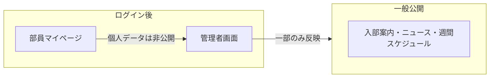

# 1. 背景と目的

## 1.1 背景

野田学園陸上競技部の現行ウェブサイトは、入部希望者・保護者向けの**一般公開用ランディングページ**として機能している。

一方、部内の運営情報（名簿、記録、練習内容、体調）は口頭・LINE・スプレッドシート等に分散していると想定される。情報が一元化されていないため、次のような困りごとが生じやすい。

## 1.2 解決したいこと

| 困りごと | 対応する機能 |
|---------|-------------|
| 「A君、今どんな状態？」がすぐ分からない | [個人ページ（統合ビュー）](./07-member-profile.md) |
| 「今日誰が休み？」が分からない | [休み・欠席管理](./03-member-management.md#14-休み欠席管理) |
| PB や大会結果がバラバラに記録されている | [部員情報・PB・大会管理](./03-member-management.md) |
| 練習内容が口頭だけで、種目ごとにばらける | [練習メニュー管理](./04-training-menu.md) |
| 週間スケジュール変更がサイトに反映されない | [スケジュール管理](./05-schedule.md) |
| 痛みの報告が続いているのに把握が遅れる | [体調・痛み管理](./06-health.md) |

## 1.3 目的

1. **部員一人ひとり**の記録・休み・体調を、選択するだけで一覧できるようにする
2. **練習メニュー**を種目ブロック単位で整理し、種目別・学年別など複数の切り口で表示できるようにする
3. **部内の全員**（先生・マネージャー・キャプテン・ブロック長・部員）がログインし、役割に応じた情報の閲覧・入力ができるようにする
4. 公開してよい情報（週間スケジュール等）だけを一般サイトに自動反映する

## 1.4 スコープ（やること）

- 部員名簿・自己ベスト・大会・休みの管理
- 練習メニューの作成・表示（**テンプレート＋チェックボックス**、詳細編集は4ロールのみ）
- スケジュールの編集と公開サイト連携（**大会日程・当日の種目別出場時刻**）
- 体調・痛みの報告（**病院風の部位選択 UI**）と管理者フォロー
- 個人ページ（統合ビュー）と PB 推移グラフ
- ログイン・ロール別アクセス制御

## 1.5 非ゴール（今回やらないこと）

- 医療診断・治療記録の管理（部活動内の安全配慮が目的）
- 保護者向けポータルは**作らない**（LINE で連絡）
- 会計・部費管理
- 外部SNS連携の自動投稿

## 1.6 サイトの3つのゾーン

| ゾーン | ルート例 | 利用者 |
|--------|---------|--------|
| 一般公開 | `/`, `/news` | 誰でも |
| 部員 | `/member/*` | 部員（ログイン） |
| 管理者 | `/admin/*` | 先生・マネージャー・キャプテン |
