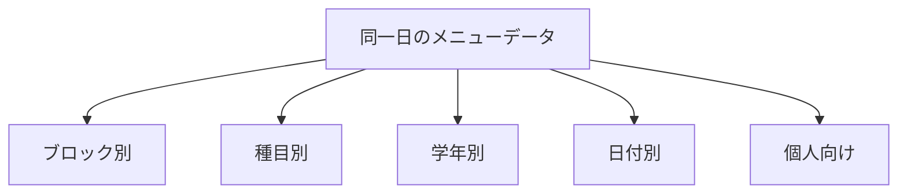

# 4. 練習メニュー管理

種目・学年・個人ごとに「今日・今週何を練習するか」を文書化する。**口頭指示の属人化を減らす**のが目的。

## 4.1 特徴

- メニューは **種目ブロック**（短距離・長距離・跳躍 等）単位で整理
- 同じ日のデータを **ブロック別 / 種目別 / 学年別 / 個人向け** など複数の切り口で表示
- 例: 短距離ブロック全体 → 100m だけ → 高2 だけ、と段階的に絞り込み

---

## 4.2 種目ブロック

> **確定:** 野田学園陸上部の練習は **3ブロック** で運用。詳細は [12. ユースケース決定事項](./12-decided-use-cases.md#uc-t01-練習メニュー作成--決定) を参照。

### ブロック一覧（確定）

| ブロック | 含む種目の例 | 備考 |
|---------|-------------|------|
| **短距離** | 100m, 200m, 110mH, 100mH, 4×100mR 等 | スプリント・短ハードル |
| **短長距離** | 400m, 400mH, 800m, 1500m, 3000m, 5000m, 4×400mR 等 | 400・400mH と長距離を同一ブロック |
| **跳躍** | 走幅跳, 三段跳, 走高跳, 棒高跳 | |
| **共通** | ウォームアップ, 筋トレ, ストレッチ, クールダウン | 全員 or 複数ブロック向け（表示用） |

各メニューには **必ず1つ以上のブロック** を紐づける。

**同日・同ブロックで複数メニュー可**（例: 100m用と200m用を別件で登録）。

### ブロック内の細分化（タグ）

| 分類軸 | 値の例 | 用途 |
|--------|--------|------|
| 種目（詳細） | 100m, 200m, 走幅跳 等 | 種目別表示 |
| 学年 | 中1〜高3 | 学年別表示 |
| 学年グループ | 中学全体, 高校全体 | まとめ表示 |
| 性別 | 男子, 女子 | 任意 |
| 個人 | 特定部員 | 個別・体調配慮版 |

**レベルタグ（新人/記録更新狙い等）は使わない。** 学年・種目で絞り込む。

**表現例**

- 短距離 × 100m × 高2 → 高2の100m向けメニュー
- 短距離 × 200m × 400m → 200m/400m 兼用
- 共通 × 全員 → 全体ウォームアップ

---

## 4.3 表示モード



### モード1: ブロック別（デフォルト・管理者）

- 日付選択 → ブロックごとに折りたたみセクション
- ▼ 共通 / ▼ 短距離 / ▼ 短長距離 / ▼ 跳躍
- **想定ユーザー:** 先生・マネージャーが練習前に全体確認

### モード2: 種目別（ブロック内ドリルダウン）

- ブロック選択（例: 短距離）→ 種目タブ（100m / 200m / 短距離全体）
- **想定ユーザー:** 短距離キャプテンが 100m 組の内容を編集

### モード3: 学年別

- 学年タブ → ブロック横断で表示

```
高2 向けメニュー（8/20）
├── [短距離] 200m ペース走 6本
├── [短距離] 100m スタート練 5本
├── [跳躍] 走幅跳 アプローチ練
└── [共通] クールダウン
```

### モード4: 日付別

- 週カレンダー + 表示切替トグル

### モード5: 個人向け（部員マイページ）

抽出ルール（優先順）:

1. 個人タグで直接割当（体調配慮版含む）
2. 主種目ブロック + 種目タグ一致
3. 学年タグ一致
4. 共通ブロック

---

## 4.4 メニューのデータ構成

### 分類

| 項目 | 必須 |
|------|------|
| 種目ブロック | ○ |
| 種目タグ（複数可） | 任意 |
| 学年タグ（複数可） | 任意 |
| 性別タグ | 任意 |
| 個人割当 | 任意 |
| 日付 | ○ |

※ タグ未指定 = その軸では「全体」

### ヘッダー

| 項目 | 内容 |
|------|------|
| タイトル | 例: 「短距離 100m スタート練」 |
| 作成者 | キャプテン / マネージャー / 先生 |
| 練習場所 | 学校 / 競技場 |
| 全体時間 | 目安 |
| 注意事項 | 持ち物、フォームのポイント 等 |
| テンプレート元 | コピー元 ID |

### 内容行（1行 = 1セット）

| 項目 | 例 |
|------|-----|
| 順番 | 1, 2, 3... |
| 種目・内容 | 100m×3本 |
| 距離/回数/本数 | 100m、3本 |
| 強度 | RPE 7、85% PB |
| 休憩 | 3分 |
| 備考 | スタート低く |

---

## 4.5 テンプレートと割当

| 概念 | 説明 |
|------|------|
| テンプレート | ブロック・タグ付きで保存、日付だけ変えて複製 |
| 日次割当 | 特定日 + ブロック + タグ に紐づけ |
| 個別調整 | 体調不良者向けに個人タグ版を追加 |

### 運用シーン

- 前日: 短距離キャプテンが「短距離 → 100m タブ」で翌日メニュー作成
- 前日: マネージャーがブロック別表示で全ブロックの揃いを確認
- 当日: 部員が「今日のあなたの練習」を確認
- 体調不良時: 個人タグ付き軽め版メニューを追加

---

## 4.6 名簿との連携

| 名簿項目 | メニューでの用途 |
|---------|----------------|
| 主種目 / 副種目 | ブロック・種目タグとの自動マッチ |
| 学年 | 学年別表示・個人向け抽出 |
| 性別 | 性別タグ付きメニューの抽出 |

名簿未登録の部員には、共通ブロックのメニューのみ表示（フォールバック）。
