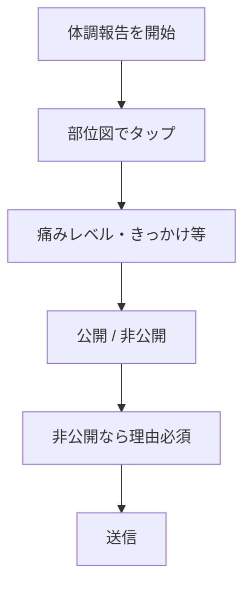

# 6. 体調・痛み管理

**練習可能かどうかの判断材料**を早期に共有する。医療診断ではなく、部活動内の安全配慮が目的。

> **入力 UI:** 病院の問診のように **「どこが痛みますか？」** と体の部位図から選ぶ。部内**全員**が自分の体調を報告できる。

---

## 6.1 体調報告（部員入力）

### ステップ1: 部位選択（体のイラスト UI）

病院の受付でよくある形式。**前面・背面のシルエット**に部位が分かれており、タップ（クリック）で選択する。

| UI 要素 | 内容 |
|---------|------|
| 体のイラスト | 前面 / 背面を切替 |
| 選択可能部位 | 頭、首、肩（左/右）、上腕、肘、前腕、手、胸、腰、股関節、太もも、膝、すね、足首、足裏、Achilles、ハム、ふくらはぎ 等 |
| 複数選択 | 可（例: 右膝 + 左ハム） |
| 左右 | 該当部位は左/右/両方を選べる |

選択後、部位名がテキストでも表示される（例: 「右膝」「左 Achilles」）。

### ステップ2: 痛みの詳細

| 項目 | 内容 |
|------|------|
| 報告日 | 自動（今日） |
| 部位 | ステップ1で選択（上書き可） |
| 痛みレベル | 0（なし）〜 10、または 3段階（軽い / 中程度 / 強い） |
| いつから | 開始日 |
| きっかけ | 練習 / 大会 / 不明 等 |
| 痛むタイミング | 走る時、着地時、翌朝 等 |
| 腫れ・熱感 | 有 / 無 |
| 今日の練習希望 | 全休 / 軽め / 通常 / 未確定 |
| 公開範囲 | デフォルト共有 / **非公開**（先生・マネージャーのみ） |
| **非公開の理由** | 非公開選択時**必須**。先生・マネージャーのみ閲覧 |
| 自由記述 | 部員のコメント（公開報告時など） |

### 画面フロー

---

## 6.2 管理者フォロー（先生・マネージャー入力）

| 項目 | 内容 |
|------|------|
| 対応内容 | テーピング、ストレッチ指示、様子見 |
| 練習制限 | 走らない、ジョグのみ、本数半分 等 |
| 受診勧告 | 有 / 無 |
| 保護者連絡 | 済 / 不要 / 要検討 |
| ステータス | 継続中 / 改善傾向 / 回復 / 長期離脱 |
| 次回確認日 | |

---

## 6.3 運用シーン

- **朝:** 部員が体のイラストで「右膝」をタップ → 痛みレベル・「今日は軽め希望」を送信
- **練習前:** 先生が体調注意者一覧を確認 → [練習メニュー](./04-training-menu.md) を個別調整
- **継続:** 同部位の報告が1週間続く → 要観察フラグ
- **個人ページ:** 「右膝負傷中」等のステータスバッジに反映

---

## 6.4 ダッシュボード

- 現在「痛み報告中」の部員一覧（部位付き）
- 部位別集計（例: 今月 膝 3件）
- 個人の報告履歴タイムライン（部位図のサムネイル or 部位名）

---

## 6.5 プライバシー

- 体調情報は **部員本人 + 管理者のみ**。他部員には見せない
- 公開サイトには **一切載せない**
- 卒部後は **卒部処理と同時に PB・体調データを削除**（[12章](./12-decided-use-cases.md#公開サイトデータ保持--決定)）
- 医療診断・治療記録ではない旨を画面に明記

---

## 6.6 他機能との連携

| 連携先 | 内容 |
|--------|------|
| [練習メニュー](./04-training-menu.md) | 個人向け軽め版メニュー |
| [個人ページ](./07-member-profile.md) | ステータスバッジ、体調タブ |
| [PB推移グラフ](./07-member-profile.md#体調との連携グラフ上) | 体調帯は**作らない**（確定） |
