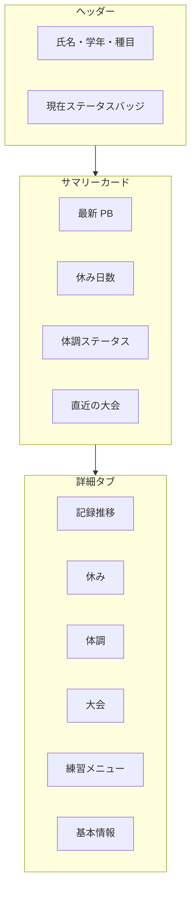

# 7. 個人ページ（統合ビュー）

**Aさんを選んだら、Aさんに関する情報が1画面にまとまって見える**機能。機能1〜4のデータを個人単位で横断表示する。

部員本人のマイページと、管理者が名簿から選ぶ個人詳細ページは**同じ構成**とし、見える範囲だけロールで変える。

---

## 7.1 解決すること

| 困りごと | 個人ページでの見え方 |
|---------|-------------------|
| 「A君、今どんな状態？」 | ヘッダーに現在ステータス（例: 足負傷中） |
| 記録の伸びを把握しにくい | 種目別 PB 推移グラフ |
| 休みが多い選手の把握が遅い | 休み日数・種別の集計 |
| 体調・記録・休みがバラバラ | 同一画面でタイムライン表示 |

---

## 7.2 ページ構成

名簿一覧 → **Aさんを選択** → 個人ページ

- 管理者: `/admin/members/{id}`（予定）
- 部員: `/member`（予定）

---

## 7.3 ヘッダー（常時表示）

| 要素 | 例 |
|------|-----|
| 氏名・学年 | 田中 A / 高2 / 短距離（100m, 200m） |
| **現在ステータス** | `練習通常` / `足負傷中` / `軽め参加` / `全休` / `休部` / `本日休み` |
| ステータス詳細 | 「左足首、痛みレベル6、8/1〜継続中」 |
| 最終更新 | 体調報告: 8/5 |

### ステータス判定ルール（優先順）

1. 休部（名簿ステータス）
2. 体調報告で「全休」かつ継続中
3. 体調報告で「軽め」かつ継続中 → `○○負傷中・軽め参加`
4. 本日 approved な休み申請あり → `本日休み`
5. 上記なし → `練習通常`

---

## 7.4 サマリーカード

| カード | 表示内容 |
|--------|---------|
| 記録 | 主種目の最新 PB。先月比があれば表示 |
| 休み | 今月 X 日 / 今学期 Y 日。内訳: 体調 Z 日 |
| 体調 | 部位 + 痛みレベル + 継続日数。なければ「問題なし」 |
| 大会 | 次の出場予定 or 直近の結果 |

---

## 7.5 タブ詳細

### タブ1: 記録推移（個人 PB 推移グラフ）

個人ページの**中核機能**。

#### グラフの基本仕様

| 項目 | 仕様 |
|------|------|
| グラフ種類 | 折れ線グラフ（1種目 = 1系列） |
| 横軸 | 計測日 |
| 縦軸 | 記録値（秒 / m） |
| プロット | 公式記録と練習記録を区別 |
| 現在 PB | 太線・ハイライト色で強調 |
| 良化の方向 | タイム: 下がるほど良い / 距離・高さ: 上がるほど良い |

#### データ点（クリックで詳細）

| 情報 | 内容 |
|------|------|
| 記録 | 11.85 秒 等 |
| 計測日・場所 | |
| 風速 | 該当種目のみ |
| 公式/練習 | アイコン or 色分け |
| 前回比 | -0.12 秒（改善）等 |

**点の見分け:** 公式=塗りつぶし丸 / 練習=中空丸 / 現在PB=星 or リング

#### 種目切り替え

- 種目タブ: 主種目をデフォルト（100m / 200m 等）
- データなし時: 「記録はまだありません」+ 追加ボタン（管理者）

#### 表示期間フィルタ

| 期間 | 用途 |
|------|------|
| 3ヶ月 | 直近の調子 |
| 6ヶ月 | 学期単位 |
| 1年 | 年度の伸び |
| 全期間 | 入部からの成長 |

#### グラフ横サマリー

| 表示 | 例 |
|------|-----|
| 現在 PB | 100m **11.52** |
| 期間内ベスト | 選択期間での最速 |
| 入部時 PB | 最初の記録 |
| 改善幅 | 入部時比 **-0.8 秒** |

#### 更新履歴表

グラフと連動。行クリック → グラフ上の点をハイライト。

| 列 | 内容 |
|----|------|
| 日付 / 記録 / 種別 / 場所 / 風速 / 前回比 / PB更新 / 備考 | |

#### 体調との連携（グラフ上）

**体調不良期間の背景帯は表示しない**（確定）。体調は体調タブで確認する。

#### 権限

| 機能 | 部員 | 管理者 |
|------|------|--------|
| グラフ閲覧 | 自分のみ | 全員 |
| 記録追加・編集 | × | ○ |
| 体調帯表示 | — | — |

---

### タブ2: 休み

| 表示 | 内容 |
|------|------|
| 集計 | 今月 / 今学期 / 年度 |
| 種別内訳 | 体調 / 学校行事 / 家庭都合 等 |
| 一覧 | 日付 / 種別 / 理由 / ステータス / 影響 |
| 操作 | 部員: 申請 / 管理者: 承認 |

---

### タブ3: 体調

| 表示 | 内容 |
|------|------|
| 現在の状態 | **部位図で選んだ部位**、痛み、制限、管理者メモ |
| タイムライン | 報告履歴（部位付き） |
| 新規報告 | [6.1 部位図 UI](./06-health.md#61-体調報告部員入力) へ |

---

### タブ4: 大会

| 表示 | 内容 |
|------|------|
| 出場予定 | 大会名・種目・**開始時刻**（[当日出場表](./05-schedule.md#54-大会当日スケジュール出場表)） |
| 過去結果 | 順位・記録。PB 更新行にマーク |

---

### タブ5: 練習メニュー

- 今日の個人向けメニュー
- 軽め版がある場合は理由を表示

---

### タブ6: 基本情報

名簿詳細。メモ等（管理者のみ編集可）。

---

## 7.6 権限マトリクス

| 情報 | 部員 | キャプテン | マネージャー | 先生 |
|------|------|-----------|-------------|------|
| 個人ページ | 自分 | 全員 | 全員 | 全員 |
| 記録推移 | ○ | ○ | ○ | ○ |
| 体調（公開） | ○ | ○ | ○ | ○ |
| 体調（非公開） | 自分 | × | ○ | ○ |
| 管理者メモ | × | × | ○ | ○ |
| 記録編集 | 自分のみ | ○ | ○ | ○ |
| 記録削除 | × | ○ | ○ | ○ |

---

## 7.7 名簿一覧との連携

| 列 | 内容 |
|----|------|
| 氏名 | クリック → 個人ページ |
| 学年 / 種目 | |
| **現在ステータス** | `足負傷中` `通常` 等（休みバッジなし） |

**フィルタ例:** 体調注意者のみ / 学年 / 種目ブロック

---

## 7.8 部員マイページ

`/member` は自分の個人ページと同じ UI。編集権限のない項目は閲覧のみ。
