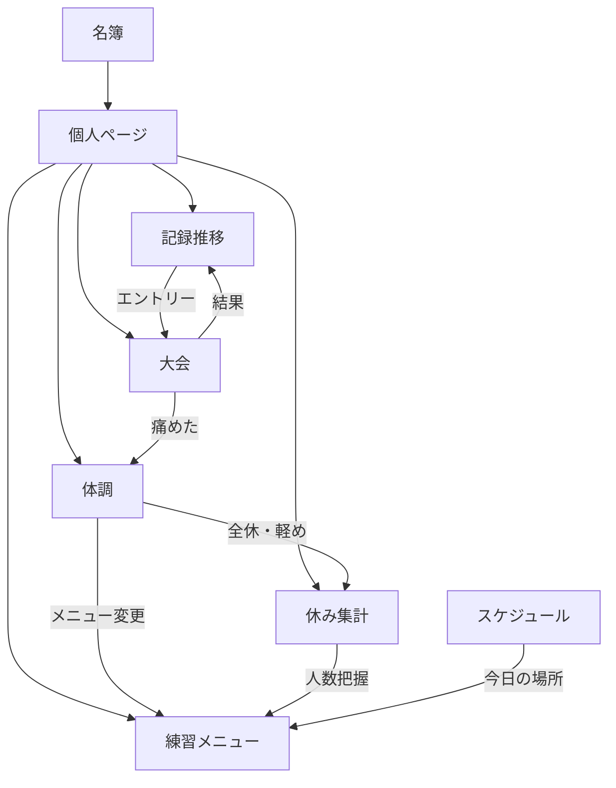

# 8. 機能間連携・運用フロー

> 各操作の詳細（アクター・手順・例外）は [11. ユースケース詳細](./11-use-cases.md) を参照。

## 8.1 機能のつながり

---

## 8.2 日常運用フロー

### 前日（マネージャー・キャプテン）

1. [スケジュール](./05-schedule.md) で翌日の場所・変更を確認
2. [練習メニュー](./04-training-menu.md) をブロック別に作成
3. 種目キャプテンが担当ブロック（種目別表示）でメニュー入力
4. マネージャーがブロック別表示で全体の揃いを確認

### 当日朝（部員）

1. [体調報告](./06-health.md)（痛みがある場合）
2. [休み申請](./03-member-management.md#34-休み欠席管理)（来られない場合）
3. マイページで「今日の練習メニュー」を確認

### 練習前（先生・マネージャー）

1. ダッシュボード: 今日の欠席者 + 体調注意者
2. 体調注意者の [個人ページ](./07-member-profile.md) を確認
3. 必要に応じて個人向け軽めメニューを割当

### 練習後・大会後

1. [PB](./03-member-management.md#32-自己ベストpb管理) を入力
2. [大会結果](./03-member-management.md#33-大会記録会の管理) を入力 → PB 自動更新
3. 痛めた場合は体調報告を促す

### 週次・学期初

1. 学期初: [週間スケジュール](./05-schedule.md) 登録 → 公開サイト反映
2. 週次: 体調注意者・休み多い部員を名簿一覧フィルタで確認
3. 大会前: 個人ページの PB 推移グラフで調子確認

---

## 8.3 シナリオ例

### シナリオ1: 足を痛めた部員

1. 部員が朝、体調報告「左足首、痛み6、軽め希望」
2. 個人ページステータス → `足負傷中・軽め参加`
3. 先生が体調タブで確認、練習制限「ジョグのみ」を入力
4. 短距離キャプテンが個人タグ付き軽めメニューを作成
5. 部員がマイページで今日のメニューを確認
6. 体調は体調タブで確認（グラフ連携なし）

### シナリオ2: 大会後の記録更新

1. マネージャーが大会結果を入力
2. 100m が PB 更新 → 個人ページの記録タブに反映
3. グラフに新しい点が追加、サマリーカードの PB 更新

### シナリオ3: 先生が部員の成長を確認

1. 名簿から A さんを選択
2. 記録タブ → 100m → 6ヶ月表示
3. 入部時比 -0.3 秒、体調帯なし → 順調と判断
