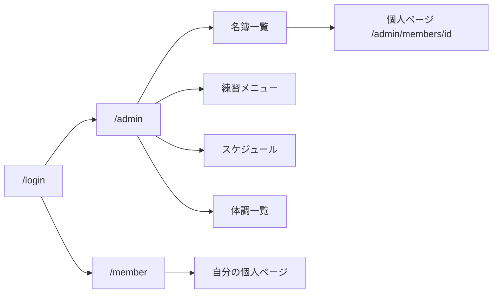

# 9. 画面一覧

## 9.1 部員向け

| 画面 | 主な内容 |
|------|---------|
| ログイン | `/login` |
| マイページ（個人ページ） | ステータスバッジ + サマリーカード + タブ |
| ┗ 記録推移 | 種目別 PB グラフ・更新履歴 |
| ┗ 休み | 申請・履歴・今月/学期の日数 |
| ┗ 体調 | 報告・履歴・現在の状態 |
| ┗ 大会 | 出場予定・結果 |
| ┗ 練習メニュー | 今日の自分向けメニュー |
| ┗ 基本情報 | 自分の名簿情報 |

---

## 9.2 管理者向け — ダッシュボード・名簿

| 画面 | 主な内容 |
|------|---------|
| ダッシュボード | 今日の欠席者、体調注意者、直近の大会 |
| 名簿一覧 | ステータスバッジ・今月休み日数付き。行クリック → 個人ページ |
| **個人ページ** | 統合ビュー（記録・休み・体調・大会・メニュー） |

---

## 9.3 管理者向け — 練習メニュー

| 画面 | 表示モード | 主な内容 |
|------|-----------|---------|
| メニュー一覧 | ブロック別（デフォルト） | 日付 → 短距離/長距離/跳躍… |
| メニュー一覧 | 種目別 | ブロック → 100m/200m タブ |
| メニュー一覧 | 学年別 | 学年タブ → ブロック横断 |
| メニュー一覧 | 日付別 | 週カレンダー + 切替トグル |
| メニュー作成・編集 | — | ブロック + タグ + 内容行 |
| テンプレート | ブロック別 | 定番メニューの保存・複製 |

---

## 9.4 管理者向け — その他

| 画面 | 主な内容 |
|------|---------|
| 大会 | 一覧、エントリー表、結果入力 |
| 休み | 承認待ち、カレンダー |
| スケジュール | 週間基本 + 単発イベント、公開設定 |
| 体調 | 注意者一覧 → 個人ページ体調タブへ |

---

## 9.5 画面遷移（概要）

---

## 9.6 UI方針（プレビュー）

- 現行公開サイトのデザインを踏襲（Noto Sans JP、青系カラー）
- スマホでも部員が体調・休みを入力しやすいフォーム
- 個人ページはタブ + サマリーカードで「今の状態」を最優先
