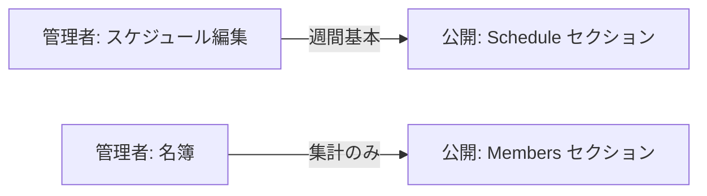

# 10. 公開 vs 内部

一般公開サイト（現行 `/`）と内部管理ツールの情報の線引き。

---

## 10.1 線引き一覧

| 情報 | 一般公開 | 内部のみ | 備考 |
|------|---------|---------|------|
| ニュース | ○ | | 現行維持（Firestore） |
| 週間練習スケジュール（基本） | ○ | | 管理画面から自動反映 |
| 大会日程 | △ | | 将来検討 |
| 部員数（学年・男女比） | ○ | | 集計値のみ。個人名は非公開 |
| PB・大会結果 | △ | デフォルト | 部員名の扱い要確認 |
| 練習メニュー | | ○ | |
| 休み・体調 | | ○ | |
| 名簿・連絡先 | | ○ | |
| 個人ページ | | ○ | |

---

## 10.2 公開サイトへの反映フロー

### 反映対象（Phase 想定）

| データ | 公開コンポーネント | 内容 |
|--------|------------------|------|
| 週間スケジュール | `Schedule.tsx` | 場所×曜日×説明 |
| 部員数 | `Members.tsx` | 学年・男女比の円グラフ |
| ニュース | `News.tsx` | 現行維持 |

### 反映しないもの

- 個人名、PB、体調、休み、練習メニューの詳細

---

## 10.3 セキュリティ原則

1. 個人を特定できる情報はログイン後のみ
2. 体調データは部員本人 + 管理者のみ
3. 公開 API / Firestore Rules で読み取り範囲を制限
4. 卒部後のデータ削除・匿名化方針を別途定める

詳細は [技術メモ](./appendix/tech-notes.md) を参照。
